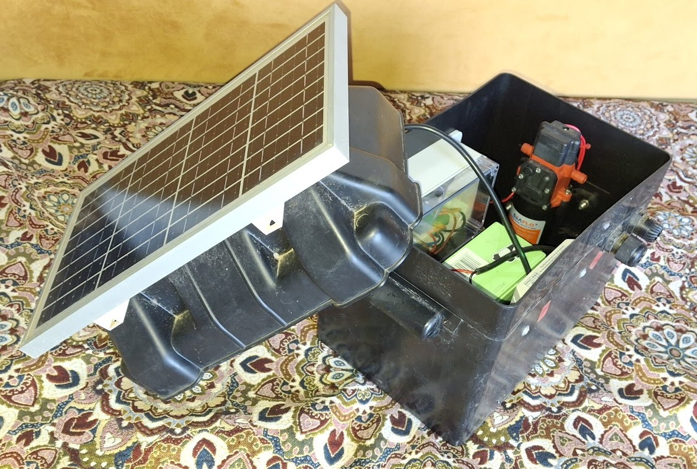

# WaterPi

Autonomous (from water and electricity networks) but connected (to the internet) watering system based on Raspberry Pi.

## Hardware

Tank to collect rain water.

Waterproof box containing:
- Solar panel 10W (on top)
- PWM regulator
- 12V lead acid battery
- 12V to 5V mini USB regulator
- Raspberry Pi Zero W
- Relay module
- 12V Pump

## Software

REST API implemented in Python with Flask.

// TODO: reverse proxy to handle authentication and security.

DuckDNS to make the API accessible to the internet.

Mobile app to do scheduled and on-demand activation/deactivation of the pump.

## Setup

Recipe available [here](Recipe).
